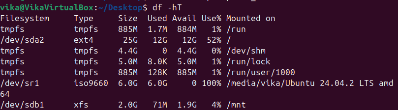
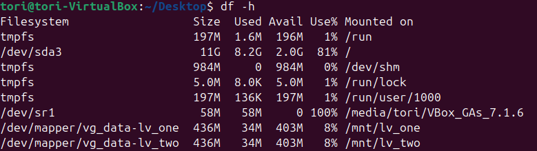
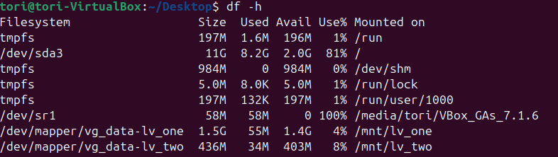
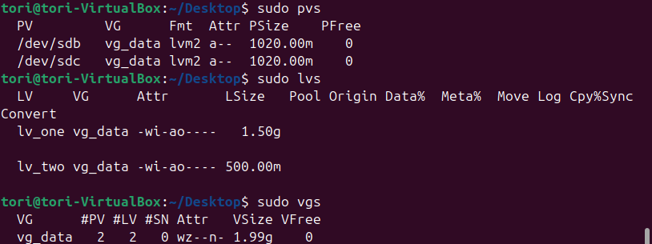

# Task 1.6 Файловые системы
### 1. Создать каталог ~/test и в нем файл test_123 с любым содержимым. Создать символическую ссылку на каталог ~/test по такому пути: /tmp/soft_link. Используя ссылку /tmp/soft_link скопировать файл test_123 в каталог /tmp с тем же именем. Создать жесткую ссылку на файл /tmp/test_123 с именем /tmp/hard_link(вывести общее и использованное количество inodes).
```bash
  mkdir ~/test
  echo "Hello, world!" > ~/test/test_123
  # Check content test_123
  cat ~/test/test_123
  # Create symbolic (soft) link
  ln -s ~/test /tmp/soft_link
  cp /tmp/soft_link/test_123 /tmp/test_123
  # Create hard link
  ln /tmp/test_123 /tmp/hard_link
  # Check inodes (total and used):
  df -i
```
### 2. Подключить к виртуальной машине новый диск 3ГБ. Создать на нем один раздел размером 2 ГБ. Разметить раздел как xfs. Смонтировать раздел по пути /mnt. Создать любой файл на смонтированной файловой системе. Сделать скриншот/запись вывода команды "df -hT". Увеличить раздел до 3 ГБ. Расширить файловую систему на новое свободное пространство. Убедится, что созданный вами файл остался внутри раздела и файловой системы после всех манипуляций. Вновь ввести команду "df -hT". В чем разница? 
```
Power off your VM. Go to setting -> Storage -> Controller Sata -> Add Hard Disk -> Create and Chose 3 Gb, Click on created Storage to add it. Run VM 
```
```bash
  # List disks to identify new one:
  lsblk
  # Will see sdb 
  # Open fdisk. Press g → to create a new GPT partition table (optional, use o for MBR). Press n → to create a new partition. Partition number: 1 (default). First sector: press Enter to accept default. Last sector: type +2G and press Enter → creates a 2 GB partition. Press w → to write the changes and exit.
  sudo fdisk /dev/sdb
  # Check the new partition
  lsblk /dev/sdb
  # To format the partition with XFS, we need to install xfsprogs package:
  sudo apt update
  sudo apt install xfsprogs
  # Format the partition with XFS
  sudo mkfs.xfs /dev/sdb1
  # Mount the partition to /mnt (Mean: Attach this partition and make it accessible at this specific folder path)
  sudo mount /dev/sdb1 /mnt
  # Create test file :
  echo "This is file"! | sudo tee /mnt/test_file.txt
  # Check mounted file systems, use command that display disk space usage:
  df -hT
  # The result (where the last string - mounted file system)
```

```bash
  sudo umount /mnt
  # Change partition to 3G. Press d → to delete old partition. Press n → to create a new partition. Partition number: 1 (default). First sector: press Enter to accept default. Last sector: type +3G and press Enter → creates a 2 GB partition. Do you want to remove the signature? Yes. Press w → to write the changes and exit.
  sudo fdisk /dev/sdb
  sudo mount /dev/sdb1 /mnt
  # This command tells Linux to grow (expand) the XFS filesystem mounted at /mnt to use all available free space on its underlying partition.
  sudo xfs_growfs /mnt
  ```
  ## LVM:
### 1. Создать новую виртуальную машину. 
### 2. Сделать скриншоты вывода комманд df -h, pvs, lvs, vgs. 
```bash
  # To get started with LVM, you need to install the lvm2 utility.
  sudo apt install lvm2
  df -h
  pvs
  vgs
  lvs
  # Screenshot:
```

### 3. Подключить 2 новых диска. 
```
Power off your VM. Go to setting -> Storage -> Controller Sata -> Add Hard Disk -> Create and Chose 1 Gb, Click on created Storage to add it. Do the same for second time. Run VM 
```
```bash
  # List disks to identify new one:
  lsblk
```
### 4. Создать новую VG, добавить в него 1 диск; создать 2 LV, распределить доступное пространство между ними поровну. 
```bash
  # To make disks available for LVM, they need to be marked (initialized) with the pvcreate utility. Initialize the First Disk as a Physical Volume (PV):
  sudo pvcreate /dev/sdb
  # Create a Volume Group (VG) vg_data using /dev/sdb
  sudo vgcreate vg_data /dev/sdb
  # Create Two Logical Volumes (lv_one and lv_two), each 500MB in size, within  Volume Group (vg_data)
  sudo lvcreate -n lv_one -L 500M vg_data
  sudo lvcreate -n lv_two -L 500M vg_data
```
### 5. Создать на обоих томах файловую систему xfs. 
```bash
  sudo mkfs.xfs /dev/vg_data/lv_one
  sudo mkfs.xfs /dev/vg_data/lv_two
```
### 6. Создать две точки монтирования и смонтировать каждый из томов. 
```bash
  # Creates directories to serve as mount points
  sudo mkdir /mnt/lv_one
  sudo mkdir /mnt/lv_two
  # Mounts each LV to its respective directory
  sudo mount /dev/vg_data/lv_one /mnt/lv_one
  sudo mount /dev/vg_data/lv_two /mnt/lv_two
```
### 7. Сделать запись/скриншот вывода команды "df -h". 



### 8. Добавить в VG второй оставшийся диск. 
```bash
  # Initialize the Second Disk as a Physical Volume (PV):
  sudo pvcreate /dev/sdc
  # Adds /dev/sdc to the existing vg_data VG
  sudo vgextend vg_data /dev/sdc
```
### 9. Расширить первый LV на объем нового диска. 
```bash
  # Extend the logical volume /dev/vg_data/lv_one to use all the remaining free space in its volume group
  sudo lvextend -l +100%FREE /dev/vg_data/lv_one
```
### 10. Расширить файловую систему на размер нового доступного пространства. 
```bash
  # Expand the XFS filesystem mounted at /mnt/lv_one to use all available space on its underlying logical volume.
  sudo xfs_growfs /mnt/lv_one
```
### 11. Сделать запись/скриншоты вывода комманд "df -h, pvs, lvs, vgs".


